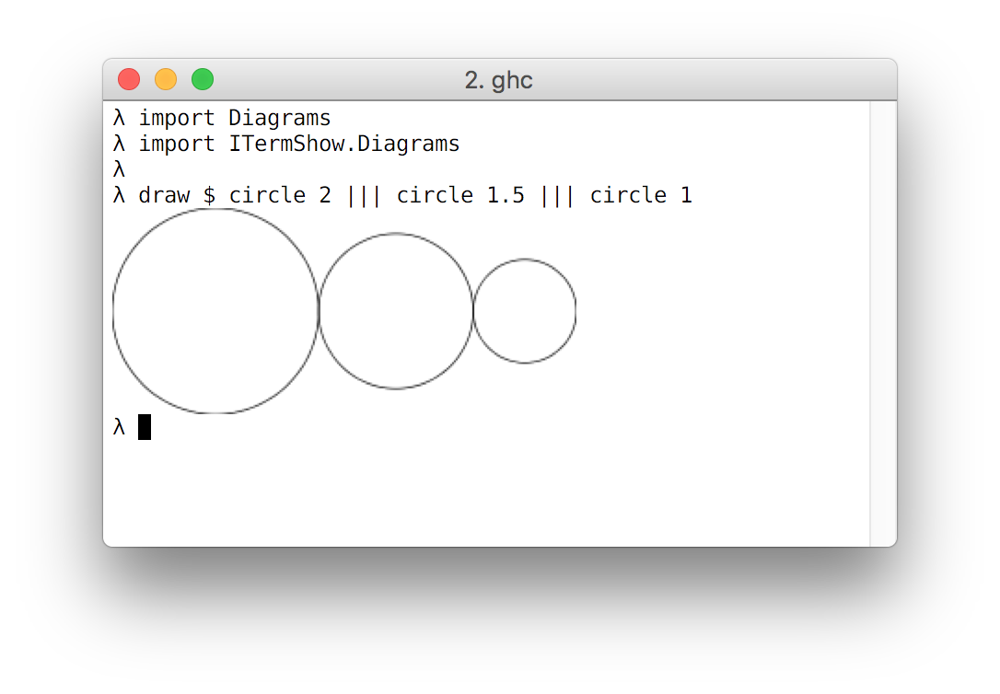

# iterm-show-diagrams

This library exports an orphan Show instance for diagrams.  
It allows you to view images inline in your terminal if it is supported by
the iterm-show library.

It also includes a function, `draw` which helps you to assign the correct
type for the show instance incase you are using very generic functions.

